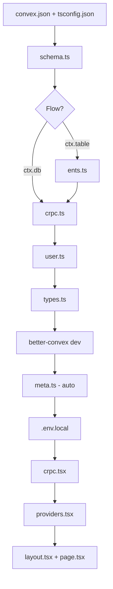

# fix: Complete quickstart documentation gaps

## Overview

A user spent 2+ hours trying to follow the getting started guide and couldn't get a working app. The documentation has critical gaps that prevent both `ctx.db` and `ctx.table` flows from working.

**Root cause:** The quickstart references files that users are never told to create, and has inconsistent code examples that don't work together.

## Problem Statement

From GitHub issue feedback (dickermoshe):

1. **Missing `types.ts`** - Step 4 imports `@convex/types` but never tells users to create `convex/shared/types.ts`
2. **Missing `ents.ts`** - `ctx.table` tab imports `./ents` but file doesn't exist and isn't documented
3. **Example project broken** - Clone + `bun install` doesn't work
4. **Scattered snippets** - Documentation has incompatible examples across sections

## Proposed Solution

Rewrite the quickstart to be a **complete, self-contained guide** that produces a working app for both `ctx.db` and `ctx.table` flows. Apply the documentation style guide from `docs/solutions/style.md`.

## Technical Approach

### Architecture

The quickstart needs to create these files in order:



### Implementation Phases

#### Phase 1: Fix Critical Blockers

**Files to modify:**
- [www/content/docs/quickstart.mdx](www/content/docs/quickstart.mdx)

**Changes:**

1. **Add `types.ts` creation step** (before Step 4 "Set Up Client")

```ts title="convex/shared/types.ts"
import type { api } from '../functions/_generated/api';

// Use this for minimal setup without HTTP router
export type Api = typeof api;

// Uncomment when you add HTTP routes:
// import type { appRouter } from '../functions/http';
// import type { WithHttpRouter } from 'better-convex/server';
// export type Api = WithHttpRouter<typeof api, typeof appRouter>;
```

2. **Add `ents.ts` creation step** (before Step 2 for `ctx.table` tab)

```ts title="convex/lib/ents.ts"
import type { GenericEnt, GenericEntWriter } from 'convex-ents';
import { entsTableFactory, getEntDefinitions } from 'convex-ents';
import type { TableNames } from '../functions/_generated/dataModel';
import type { MutationCtx, QueryCtx } from '../functions/_generated/server';
import schema from '../functions/schema';

export const entDefinitions = getEntDefinitions(schema);

export type Ent<TableName extends TableNames> = GenericEnt<
  typeof entDefinitions,
  TableName
>;

export type EntWriter<TableName extends TableNames> = GenericEntWriter<
  typeof entDefinitions,
  TableName
>;

export const getCtxWithTable = <Ctx extends MutationCtx | QueryCtx>(ctx: Ctx) => ({
  ...ctx,
  table: entsTableFactory(ctx, entDefinitions),
});
```

3. **Add `convex-ents` to installation** for `ctx.table` flow

```bash
# For ctx.table users
bun add convex-ents
```

4. **Add `.env.local` setup** (before "Initialize Convex")

```bash title=".env.local"
NEXT_PUBLIC_CONVEX_URL=http://localhost:3210
NEXT_PUBLIC_CONVEX_SITE_URL=http://localhost:3211
```

5. **Fix crpc.ts import paths** - ensure both tabs use correct paths

```ts
// Correct paths with convex.json "functions": "convex/functions"
import { query, mutation } from '../functions/_generated/server';
import type { DataModel } from '../functions/_generated/dataModel';
```

#### Phase 2: Fix Server Setup Doc

**Files to modify:**
- [www/content/docs/server/setup.mdx](www/content/docs/server/setup.mdx)

**Changes:**

1. **Update import paths** from `'./_generated/server'` to `'../functions/_generated/server'`
2. **Add callout** explaining the paths depend on `convex.json` folder structure

#### Phase 3: Add Verification Checkpoints

Add "Expected result" callouts after each major step:

| Step | Checkpoint |
|------|------------|
| Configure Folder Structure | `convex.json` and `tsconfig.json` created |
| Initialize Convex | `convex/shared/meta.ts` auto-generated |
| Define Schema | Convex dev shows "schema.ts deployed" |
| Create cRPC Builder | No TypeScript errors in `convex/lib/crpc.ts` |
| Set Up Client | `npm run dev` starts without errors |
| Use It | Page shows "Loading..." then user list |

#### Phase 4: Fix Example Project

**Files to modify/create:**
- [example/README.md](example/README.md) (create)
- [example/.env.example](example/.env.example) (create if missing)

**Changes:**

1. **Create example/README.md** with:
   - Prerequisites (Node 20+, Bun)
   - Setup steps (specific to monorepo structure)
   - How to run locally
   - Troubleshooting

2. **Add .env.example** with placeholder values

```bash title="example/.env.example"
NEXT_PUBLIC_CONVEX_URL=http://localhost:3210
NEXT_PUBLIC_CONVEX_SITE_URL=http://localhost:3211
NEXT_PUBLIC_SITE_URL=http://localhost:3000
```

## Acceptance Criteria

### Functional Requirements

- [ ] New user can follow ctx.db quickstart from scratch → working app
- [ ] New user can follow ctx.table quickstart from scratch → working app
- [ ] TypeScript passes with zero errors at each step
- [ ] All imports resolve correctly
- [ ] Example project runs after documented setup steps

### Non-Functional Requirements

- [x] Documentation follows style guide (`docs/solutions/style.md`)
- [ ] Uses Steps component for multi-part processes
- [x] Includes callouts for gotchas and prerequisites
- [x] Progressive disclosure (simple first, complexity later)

### Quality Gates

- [ ] Run simulation test (`docs/solutions/simulate-doc.md`) on both flows
- [ ] Zero TypeScript errors when following guide literally
- [ ] App renders and displays data from Convex

## Success Metrics

1. **Issue resolved** - User (dickermoshe) confirms guide works
2. **Time to working app** - Under 15 minutes for ctx.db flow
3. **Zero import errors** - All `@convex/*` imports resolve

## Dependencies & Prerequisites

- Access to www/content/docs folder
- Understanding of fumadocs markdown syntax (Tabs, Tab, Callout)
- Better Convex dev server working locally for testing

## Risk Analysis & Mitigation

| Risk | Mitigation |
|------|------------|
| Breaking existing users who followed old guide | Changes are additive - adding missing steps, not changing existing ones |
| ctx.table flow significantly more complex | Keep it in tabs but add prominent note about extra setup |
| Example project has many deps | Document it's a "full example" and quickstart is minimal |

## File Changes Summary

| File | Change Type | Description | Status |
|------|-------------|-------------|--------|
| `www/content/docs/quickstart.mdx` | Edit | Add types.ts, ents.ts, env vars steps | ✅ Done |
| `www/content/docs/server/setup.mdx` | Edit | Fix import paths | ✅ Done |
| `example/README.md` | Create | Document example project setup | ✅ Already exists |
| `example/.env.example` | Create | Template for env vars | ✅ Already exists |

## MVP

### quickstart.mdx changes

Key additions (pseudo-diff):

```diff
## Installation

```bash
bun add convex better-convex convex-helpers zod @tanstack/react-query
```

+<Tabs groupId="db" items={["ctx.db", "ctx.table"]} persist>
+  <Tab value="ctx.db">
+    That's all you need for the standard flow.
+  </Tab>
+  <Tab value="ctx.table">
+    For Convex Ents (ctx.table), also install:
+    ```bash
+    bun add convex-ents
+    ```
+  </Tab>
+</Tabs>

+## Environment Variables
+
+Create `.env.local` with your Convex URLs:
+
+```bash title=".env.local"
+NEXT_PUBLIC_CONVEX_URL=http://localhost:3210
+NEXT_PUBLIC_CONVEX_SITE_URL=http://localhost:3211
+```

+## Create Ents Helper (ctx.table only)
+
+<Tabs groupId="db" items={["ctx.db", "ctx.table"]} persist>
+  <Tab value="ctx.db">
+    Skip this step - you'll use `ctx.db` directly.
+  </Tab>
+  <Tab value="ctx.table">
+    Create the ents helper to enable `ctx.table`:
+
+    ```ts title="convex/lib/ents.ts"
+    // [full ents.ts content]
+    ```
+  </Tab>
+</Tabs>

+## Create Shared Types
+
+Create the type utilities for client-side type inference:
+
+```ts title="convex/shared/types.ts"
+import type { api } from '../functions/_generated/api';
+
+export type Api = typeof api;
+```
+
+<Callout icon={<InfoIcon />}>
+When you add HTTP routes later, update this to use `WithHttpRouter`. See [Templates](/docs/templates#typests).
+</Callout>
```

## References

### Internal References

- Style guide: [docs/solutions/style.md](docs/solutions/style.md)
- Simulation testing: [docs/solutions/simulate-doc.md](docs/solutions/simulate-doc.md)
- Example types.ts: [example/convex/shared/types.ts:1-22](example/convex/shared/types.ts)
- Example ents.ts: [example/convex/lib/ents.ts:1-41](example/convex/lib/ents.ts)
- Current quickstart: [www/content/docs/quickstart.mdx](www/content/docs/quickstart.mdx)
- Templates: [www/content/docs/templates.mdx](www/content/docs/templates.mdx)

### External References

- GitHub Issue: https://github.com/udecode/better-convex/issues/42

### Related Work

- N/A (first comprehensive quickstart fix)
